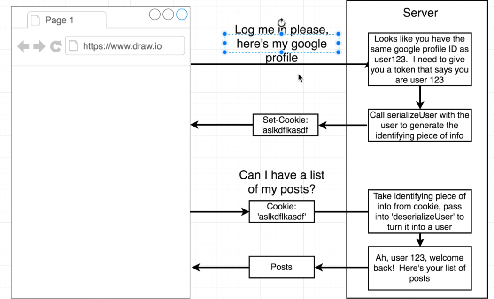
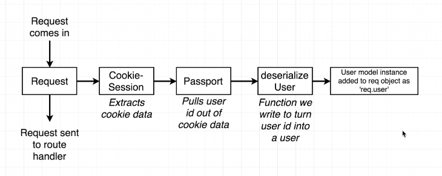

**Auth flow**

**Request flow**

**Serialize - Deserialize**

- saved to session  
- req.session.passport.user = {id: '..'}
    passport.serializeUser(function(user, done) {
    done(null, user.id);
    });

=> user object attaches to the request as req.user
    passport.deserializeUser(function(id, done) {
    User.findById(id, function(err, user) {
        done(err, user);
    });
});

